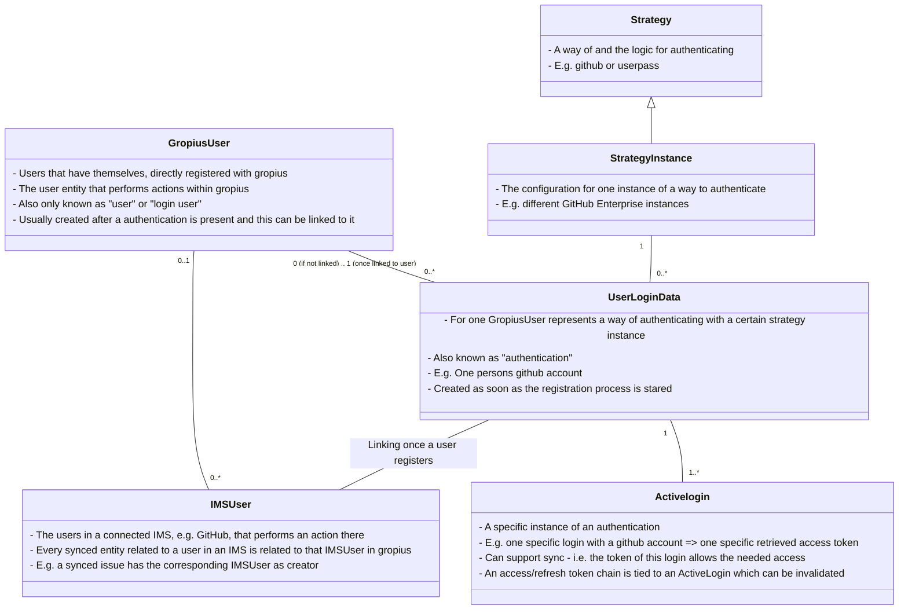

# How-To Login-Service (or rather Hot-To use the Gropius Backend at all)
This How-To will the essential steps to get a Gropius installation going including a fully functional login-service. It will use the testing docker-compose file, as the development docker-compose file uses the dev login service which is intended to easily provide access tokens but does not include the full login service functionality.

:::caution
Some steps taken in this how to might however NOT be appropriate for a production setup!
:::

## Tldr (Steps-Summary; see below for details)
1. Clone the repository
1. Configure everything
    a. Set the service configurations
    b. If desired - create default/initial strategy instance, admin-user, and OAuth client using the config
1. Run the services and - if desired - access the `/login-debug` page
1. Get an access token for the default user by logging in using the userpass strategy
1. Configure/Create one (or more) OAuth clients with the desired redirect URL and - if desired - client secrets
1. [Create a GitHub OAuth App](https://github.com/settings/applications/new) and retrieve the client id and client secret (https://developer.atlassian.com/console/myapps/)
1. Create/Configure a github-strategy instance with the client id and secret (enable login, sync and if desired self & implicit registration)
1. Run the redirect OAuth flowusing the github-strategy instance and an OAuth client
    a. Choose between login(/implicit-register), register or register with sync
1. Request an access token after returning from GitHub
    a. Will be a registration token if (implicitly or explicitly) registering
    b. Will be a full access token if loggin in
1. If registering: Link the OAuth authentication to a user
    a. Create a new user using the registration token and additional user data
    b. Link as new authentication for an existing user using the registration token and an access token for that user
1. If registering new: Convert the registration token to a full access token by refreshing it
1. Use the graphql API using a full access token retrieved by any means (userpass, github, refreshing, ...)
1. If expired or even before expiry: Refresh your access token to get a new one

## Cloning
To use the Gropius backend, you have to clone all required sources. The easiest way is to use the [Gropius](https://github.com/ccims/gropius) repository.
Run the following commands to clone the repository into your current workdir:
```
git clone --recursive https://github.com/ccims/gropius.git
cd gropius
```

## Configuration
The login service (as well as most of the Gropius services) is configured using environment variables. These can (depending on the way of deploying) be set in actual the console/system environment, the docker-compose file or an environment file. For a docker-compose based installation, using the docker-compose file is recommended. When deploying (the login-service) outside docker, configure your setup in a `gropius-backend/login-service/.env.[dev/prod].local` file.
Variables on the environment (either set in the docker-compose file or the console environment will take precedence over variables set in a `.env` file).

The following sections will describe the most important config settings needed to get running. Especially a production environment you want to consider all configuration for all services.

We recommend you perform the configuration changes described in the following in the file `docker-compose-testing.yaml`

### Access token expiration
The setting `GROPIUS_ACCESS_TOKEN_EXPIRATION_TIME_MS` takes a number of milliseconds after which issued access tokens (no matter the scope) will expire. 
The docker compose file sets this to 10 minutes by default. For development, you might want to consider increasing this time, so you don't need to refresh your token every 10 minutes. For a production setup you can still increase this a bit but revoking currently valid access tokens isn't trivial.

### Initial user creation
To be able to interact with the system and access it, you need a user account. You can specify config options that will cause the login service to ensure that the needed entities are present on startup.
You will need to create a strategy instance (specifying the way you will login with the created user), an auth client and the user itself.

:::info
It is recommended, you only specify these configuration options on the initial launch and remove them once the system is set up. You can always add them if you lost access etc.
:::

#### Strategy instance creation
Creating an instance of the `userpass` strategy will be the most useful, as you will then be able to log in using a username and password.
Needed configuration variables:
- `GROPIUS_DEFAULT_STRATEGY_INSTANCE_TYPE`: The Strategy to instance. `userpass` is recommended.
- `GROPIUS_DEFAULT_STRATEGY_INSTANCE_CONFIG`: The configuration for the strategy instance. The userpass strategy does not require any configuration. Set this to `{}`
- `GROPIUS_DEFAULT_STRATEGY_INSTANCE_NAME`: The name for the strategy instance to create. The instance will only be created, if no login strategy instance with this name exists yet. Else creation will be skipped.

#### Initial admin user creation
You can create a user that you can log in with to access the system.

:::info
Any users created using the configuration options will be created as admin users.
:::

Needed configuration variables:
- `GROPIUS_DEFAULT_USER_USERNAME`: The username of the new user to create. Must be unique. If a user with the specified username already exists, no new user will be created.
- `GROPIUS_DEFAULT_USER_DISPLAYNAME`: The clear text display name of the user to be created.
- `GROPIUS_DEFAULT_USER_STRATEGY_INSTANCE_NAME`: The name of the strategy instance with which to register the new user. This can be the name set in `GROPIUS_DEFAULT_STRATEGY_INSTANCE_NAME`.
- `GROPIUS_DEFAULT_USER_POST_DATA`: The variables to "send" to the user registration process. The exact structure depends on the chosen strategy instance. For an instance of userpass the post data should look like `{"password": "PASSWORD_OF_THE_NEW_USER"}`

#### Auth client creation
As every active login of a user must be bound to an auth client (a software that required the user to authenticate) you need to create one as well.

:::caution
The auth client will be created WITHOUT requiring a client secret. This means EVERYBODY who knows the id of the client can simply initiate a user login as this client. It is recommended, you add at least a client secret immediately after setup. Especially if the service is accessible for others.
:::

Needed configuration variables:
- `GROPIUS_DEFAULT_AUTH_CLIENT_NAME`: The name of the auth client to create. If an auth client with this name already exists 


## Initial startup
To start all services (running in testing mode = debugging web interface ports are exposed) run:
```
docker compose -f docker-compose-testing.yaml up
```

:::caution
This compose file should not be used in production
:::

To verify, that the login-service is running, using a browser access the following URL (replace `[HOST_OF_DOCKER_MACHINE]` with `localhost` if you are running the browser on the machine you are executing the docker containers on). You should see the Swagger API documentation for the login service.
```
http://[HOST_OF_DOCKER_MACHINE]:3000/login-api-doc
```

## Using the login API
The following section describes the basic functionality of the login API and the steps to take to interact with the backend after the initialization described above.
The login service acts as [OAuth2.0 server according to the specification](https://www.rfc-editor.org/rfc/rfc6749) so you can also send requests directly (using e.g. postman).

## The debug page
The debug page is deployed at `/login-debug` and shows all request details for all steps. It was created for more conveniently interacting with the login API without requiring to manually put together http-requests while still showing how the requets are structured.

### Functionality
The debug page lists the most important queries for interacting with the login service and makes it easy to execute them.
Every request has the following components:
- Headline: Describes what the request does
- Input fields: Prompt for all data required for executing the request (sometimes the headline might contain an input field)
- Request method + URL: The Data from the input fields and settings is assembled into the request URL. The method is shown in front of it.
- Request body (if needed): If the request requires sending data in the body, the body (assembled from the input) is shown below the URL
- "Request"-Button: Sends the request as shown with the method, URL and body and displays the result as specified in the settings.

### Settings
On the top of the debug page, you can set a few preferences. They are saved in your browsers local storage, meaning they will persist across reloads/restarts as long as you don't clear it manually or the URL of the page changes.
- `Gropius system hostname`: 
    - The URL where the gropius backend (and especially the login-service) is running
    - It is automatically populated with the URL you used to access the debug page.
- `Replace filled token fields`:
    - If this is checked, the fields for access and refresh token will be overwritten if any requests that returns new tokens is executed
    - If not checked, the fields will only be filled if they are empty
- `Access token`:
    - This access token will be used for requests that require authentication
    - It will initially be empty
    - It will be automatically populated if you execute a query returning tokens
- `Output responses to`:
    - Sets where the http-response-body of the requests should be output to
    - Dev-Console (default): The browser-develomplent console (in most browsers accessed by pressing F12). Recommended as most browsers provide formatting and advanced exploration tools for JSON output
    - Popup: On response open a (modal) popup dialog
    - Textbox at bottom: Append the result to the textarea at the bottom of the page. Recommended if you don't have access to the development console
    - Console+Popup: Combination of options "Dev-Console" and "Popup"

The following step-by-step guide will assume you are using the debug page.

### Custom/Manual requests
The debug page allows sending custom requests with the convenience of automatically completing the URL and adding the credentials.
To use this, the function `request(...)` is provided in the developent console (F12 in most browsers).

Method signature: `async request(url, method = "GET", body = undefined, token = this.accessToken)`

Example usage to request the registration data suggestion: `request("login/registration/data-suggestion", "POST", 
{"register_token": "token"})`

## Retrieving an access token using the `userpass` strategy
Once initialized with a default admin user as described above, you likely want to log in and retrieve a token for this user.

1. Show all existing userpass strategy instances
    - Every set of credentials is bound to one specific strategy instance
    - To log in using a strategy instance, you neet its id
    - If you followed the setup above, one userpass instance should have been created
1. Log in using username and password
    - The ID of the userpass instance was autofilled from the previuos step
    - Fill in username and password that you specified in the configuration
1. Access and refresh token
    - The fields for access and refresh token should now be filled
    - If you ran the requests manually, make sure to save both tokens as the access token will expire after the set period of time and you will neet to refresh it

:::caution
If you are in a production environment or set `GROPIUS_ALLOW_PASSWORD_TOKEN_MODE_WITHOUT_OAUTH_CLIENT=false`, then you need to authenticate with an OAuth client for **every** request involving access tokens. See "OAuth clients" below.
:::

### Refresh token
- If you request a token refresh, your old access AND refresh token will become invalid.
- The access and refresh token fields on the debg page will automatically be filled with the new tokens (idependant of the settings)

:::caution
If a refresh token is used twice, the whole chain of tokens including the valid ones will be inalidated for security reasons.
:::

### Registering using `userpass`
If you want to register using username and password or add a new username+password credentials to an account, perform the same steps as for logging in above but with a new username/password. You will receive a registration token. Continue with user linking/creation described below.

## Using the GitHub strategy
### OAuth clients
For any strategy that requires redirecting (e.g. github) and doesn't simply accept credentials posted to the token-endpoint (e.g. userpass), the client-software needs to authenticate against the login API as an OAuth client according to the specification.

:::info
From the [OAuth2.0 specification](https://www.rfc-editor.org/rfc/rfc6749):

In OAuth, the client requests access to resources controlled by the resource owner and hosted by the resource server, and is issued a different set of credentials than those of the resource owner.
[...]
For example, an end-user (resource owner) can grant a printing service (client) access to her protected photos stored at a photo-sharing service (resource server)
:::

#### List all OAuth clients
If you created an OAuth client using the initialization config described above, you can retrieve its id using this request.

If a valid client which requires no secret is found, its id will be autofilled in the edit OAuth client and run OAuth flow sections.

#### Edit existing/Create new OAuth Client
To successfully run a redirect OAuth flow, the client needs a redirect URL. This is the URL the OAuth code will be sent to for request ing a token.

To update the existing client (created during initialization) with the debug page used as redirect url:
1. List all OAuth clients
    - This will automatically populate the inputs for editing the client with the current values
1. Set the correct redirect URL
    - To use the debug page as client, add its URL to the redirect urls
1. Enable the client and disable client secrets (NEVER have an enabled client with no secrets in an production environment)

### The `github` strategy instance
:::info
To be able to log in using the github strategy, you need to [create a GitHub OAuth app](https://github.com/settings/applications/new).

The `Authorization callback URL` will need to be set to the appropirate URL on the login API. The callback URL needs to have the following format:
`http://HOST_OF_YOUR_LOGIN_API:3000/authenticate/oauth/ID_OF_THE_GITHUB_STRATEGY_INSTANCE/callback`
Where you need the id of the created github strategy instance. So to be able to retrieve the client id and client secret needed for creation of the instance, prefill this field with the url above where you only replace the `HOST_OF_YOUR_LOGIN_API` with the appropriate hostname (e.g. localhost).

You will need the created client id and the client secret while creating an instance of the github strategy.
:::

#### Show all existing github strategy instances
If you list all github strategy instances and one or more already exist, the input fields for editing/creating a github strategy instance will be prepopulated with the current values

#### Create new/Edit existing github strategy instance
Create a new gitub strategy instance or edit an existing one:

1. [Create a GitHub OAuth App](https://github.com/settings/applications/new) (see above)
1. Fill in your GitHub-OAuth-App client id and client secret
1. Set the flags according to your preferences (Reccomended: All flags enabled)
    - Enable login: Allows users to use this instance to retrieve a full access token to the gropius backend
    - Enable self registration: Allows users to create an account **themselves** based on an authentication with this instance. Administrators will always be able to register using an instance
    - Enable sync: If users decide to grant sync permission, this strategy will be used to perform the actions the users perform in gropius as that user on GitHub instead of as a dummy user
    - Allow implicit register: If a user tries to log in that isn't registered, this will automatically start the registration process. Otherwise users need to explicitly choose to register.
1. Execute the creation/edit
1. [Update the GitHub OAuth App](https://github.com/settings/developers) `Authorization callback URL`
    - Retrieve the id of the created/edited instance from the response of the execution or by listing all existing github strategy instances
    - Set the `Authorization callback URL` to the pattern: `http://HOST_OF_YOUR_LOGIN_API:3000/authenticate/oauth/ID_OF_THE_GITHUB_STRATEGY_INSTANCE/callback`
    - Replace `HOST_OF_YOUR_LOGIN_API` in the pattern with the hostname where you access the login api (e.g. localhost)
    - Replace `ID_OF_THE_GITHUB_STRATEGY_INSTANCE` in the pattern with the id retrieved

### Running the OAuth redirect flow
To run a redirect flow you need the id of an OAuth client and the id of the strategy instance (see above).

1. Choose the mode of the flow
    - login: Get access token if already registered and linked to account or register (without sync) if the instance has implicit registration turned on
    - register: Register a new authentication (either to create a new user or to link to an existing user). Will return a registration token instead of a full access token. If already registered, this is equivalent to login
    - register-sync: Register a new authentication (either to create a new user or to link to an existing user). This will however request sync (repository edit) permissions from the user. If already registered, this will "upgrade" the registration to a registration with sync.
1. Initiate the flow by redirecting the user to the appropriate authorize URL
1. Authorize using the third-party where you are redirected to (e.g. GitHub)
1. Finally, the login API will redirect back to the specified redirect-url (see "Edit existing/Create new OAuth Client")
    - The redirect will contain the "code" in the query parameters needed to retrieve the actual token
    - If this is set to the debug page, the input field for the code below "Request an access token using the retrieved code" will automatically be prefilled
    - If the OAuth client you used to initiate the flow requires a secret, enter it in the field, otherwise leave it empty
1. Executing the token request will return an access and a refresh token
    - The token will either have full API access (scope: backend login)
    - Or it will be a registration token (scope: login-register). This token will be autofilled in the registration/linking form 

## Register new/Link existing user with authentication
The following section describes user registration/linking. This only works if the authentication has not yet been linked to a user.
I.e. the authentication was done using the "register(-link)" modes or using implicit registration, thus a registration token is present for the authentication (token scope: login-register). A already linked authentication can not be re-linked to another user.

### The user concept of the gropius backend
This section shows and explains the different entities and their relations that are useful to know when dealing with users within the gropius system. 

_Note: The following diagram not necessarily represents classes/relations in code 1:1. It is a simplification for showing the concepts_



### Register as new user
If the authentication is for a user not yet present (as GropiusUser; it is possible that an IMSUser representing the same user already exists, this is however irrelevant) in the system, a new user needs to be created:

1. Enter the registration token retrieved during authentication
    - If e.g. an OAuth flow returns a registration token (insteaf of an access token) the debug page will automatically fill the appropriate field
1. It is possible to query a for a "data suggestion" for the new user based on the authentication
    - These should be the values the input fields for the user should be prefilled with
    - The debug page does this if the data-suggestion is requested
    - The data suggestion is based on data collected by the authentication (e.g. username and email from GitHub)
1. Fill the needed new user fields (either via the data-suggestion or manually)
1. Run the user creation

This will cause the user to be created and the authentication to be linked to the new user. If the authentication is executed again, it will no longer return a registration token but instead a full access token directly.

:::info
It is not needed to run the authentication again after registration to get a full access token. Using the currently active refresh token returned with the registration token and running the token refresh will return a full access token once registered
:::

### Link to existing/logged in user
If the user that authenticated is already present (as GropiusUser) and just wants to add a new authentication to the account (or allow for sync) then no new account should be created but instead the authenticaiton should be linked to the existing user.

1. Access token
    - Make sure you have an active, valid, full access token (independant of the authenticaiton)
    - The token should be for the account to link to or an administrator token
1. Link to other user (not the one logged in with the above token)
    - If you have an andmin access token you can link a registration to any existing user
    - Enter the id of the user to link to in the required field
1. Perform linking
    - Enter the registration token (autofilled if one is obtained on the debug page)
    - Execute self or admin linking

If the linking was successfull, the authentication is now linked and represents the user. Like with user creation, it is possible to exchange the registration token for a full access token (this is however likely not needed as for linking a already valid full access token is required).

### Linking of IMSUsers and GropiusUsers
_Note: This section describes what happens in the background after user linking and is not relevant to using the login API, you can skip it if you want._

After a link between a user and authentication that uses a strategy instance representing an IMS (e.g. a github instance, NOT a userpass instance) has been created, the system matches all IMSUsers on that IMS that represent the user in that authenticaion to that authentication. 
In the next step all the matched IMSUsers are linked with the GropiusUser that the authentication has been linked to.
This allows the gropius system to relate actions performed by one person in an IMS (thus by one specific IMSUser) to that persons GropiusUSer (thus their "account" within gropius).
But the relation is then also possible the other way around, allowing the system to find the IMSUser (and potentially an access token) when the person performs an action within Gropius.
This information is then used to populate the IMS synced to with the correct user information (and if a token is present even in the name of that person).
