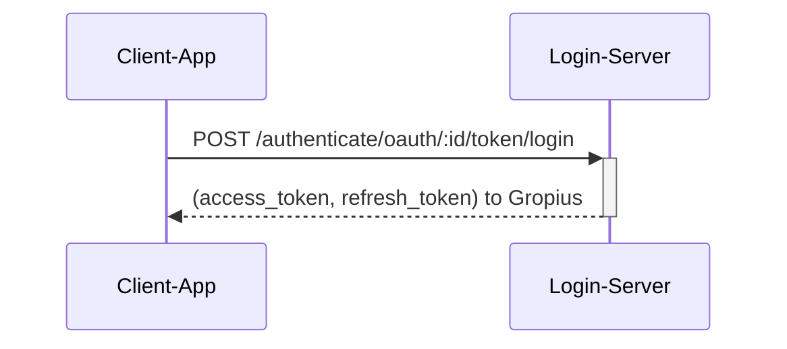
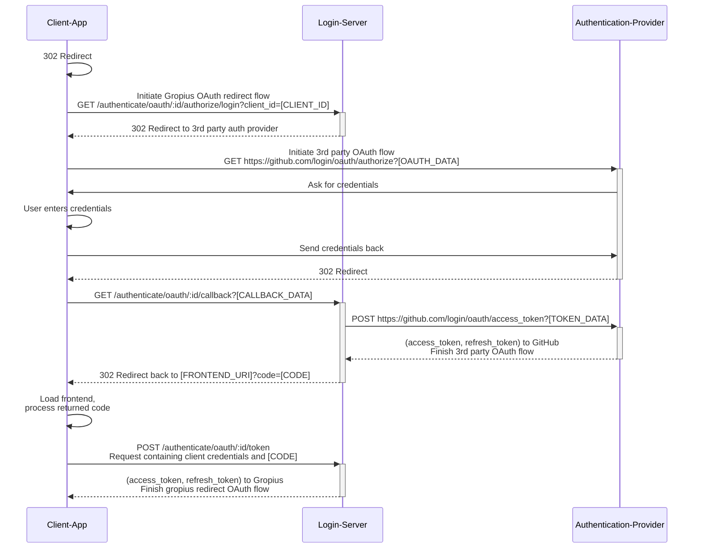
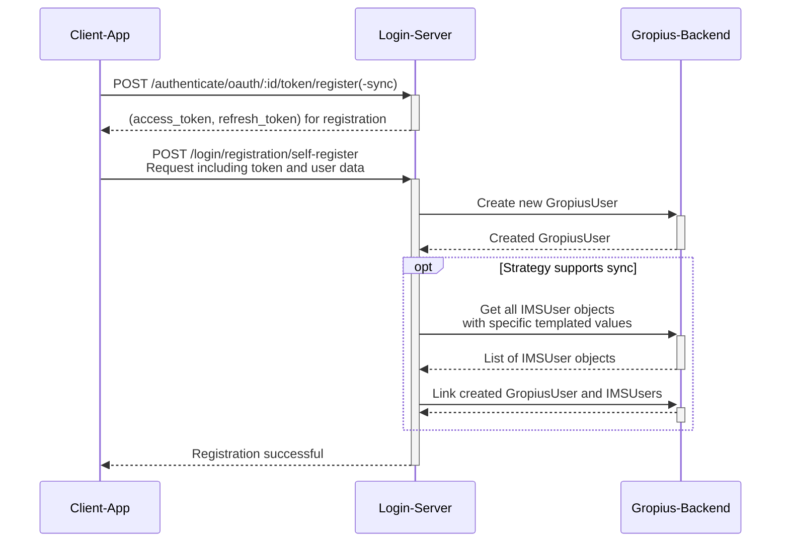

# Login Service

The following doc page uses [the defined terminology](#Terminology)

[NestJS](https://nestjs.com/) service providing authentication and login services for the gropius-backend.

It allows using different authentication providers (called _"strategies"_) to

-   Authenticate a user for usage of the gropius backend and/or
-   Let the user provide credentials to gropius for usage in the sync

The service is designed in a way that adding a new strategy, i.e. a new way in which the user can authenticate, takes as few lines of code as possible.

## Strategies

A strategy is defined by the following capabilities

-   Performing the authentication
-   Checking the configuration of a strategy instance

Strategies are defined as service classes (which can be part of the main code base or provided by separate modules).

One strategy corresponds to one _type_ of authentication (e.g. GitHub OAuth, OpenID connect). Of this type _"strategy instances"_ ca be created that represent one actual authentication provider (e.g. a specific GitHub Enterprise instance, Microsoft Azure OpenID connect).
Instances can be created at runtime by instanciating one defined strategy and providing all required configuration (e.g. for GitHub OAuth the OAuth Endpoints and client credentials).

Once a user authenticates using a strategy instance, this authentication creates _"login data"_, representing the association of the authenticated gropius-user and the strategy instance. It contains all data required to "recognize" a user on following authentications.
A single login/authentication event for one login data is called a _"active login"_

The currently available strategies are all based on [passportjs](https://www.passportjs.org/) to handle the retrieval of credentials. This reduces the needed code for each strategy even further.

### Strategies with sync capability

A strategy has the sync capability, if an instance of it could be able to provide credentials for authenticated users that can be used in the sync process to impersonate the user in an IMS.

In that case, the strategy corresponds to a specific IMSTemplate in the gropius-backend as it references a type of IMS.
The strategy instance represents any number of IMSs of the IMSTemplate of the strategy. Even if multiple IMSs referencing the same real issue management system (e.g. a specific GitHub Enterprise) exist in the backend, only one strategy instance will/should be present in the login service.
One login data (authentication of a user using a strategy instance) maps to all IMSUser objects in the backend that also represent that user in any IMS object corresponding to the single actual issue management system.

Strategies that have the sync capability must provide the following additional functionality:

-   Provide the credentials for the sync given login data
-   Set required templated field values that an IMS needs to match in order to be considered an IMS that represents the same issue management system as the strategy instance
-   Set required templated field values that an IMSUser needs to match for it to belong to a given login data
-   Set required data contained in the login data for it to be considered a match for a given IMSUser (opposite direction to previous)

### Strategies allowing implicit signup

Strategies can choose to allow implicit signup. This an authentication to automatically be treated as registration even if it was only intended as a login if no user was found for the authentication

### `userpass`-Strategy

Basic username password strategy.
Properties:

-   Can login users to access the backend
-   Does NOT need a redirect auth flow
-   Does NOT allow implicit signup

### `github`-Strategy

Basic username password strategy.
Properties:

-   Can login users to access the backend
-   Lets users provide credentials to the GitHub Instance referenced by the respective strategy instance
-   DOES need a redirect auth flow
-   Does allow implicit signup

## Authentication flow types

The service provides two types of authentication flow. Different strategies may require one of the two or allow both.
Additionally the refresh token flow exists to aquire a new valid access token using a refresh token as the access tokens have a limited life-span.

:::info
**NOTE**: All authentication interaction is compatible with the OAuth 2.0 specification ([RFC 6749](https://www.rfc-editor.org/rfc/rfc6749)). Knowledge of the functioning principle as well as required request types, headers, parameters etc. is expected in the following.
:::

Both flow types support three modes:

1. `login` (default if none given): Login using authentication to an existing user
2. `register`: Authenticate to create a new user or add auth method to existing user
3. `register-sync`: Authenticate to create a new user or add auth method to existing user. (If supported by strategy) Asks the user for credentials that also allow sync.

### Post Credentials Flow

Alias password-Flow.

This flow is (depending on the strategy) either identical or closely related to the [Resource Owner Password Credentials Grant](https://www.rfc-editor.org/rfc/rfc6749#section-4.3) of OAuth 2.0.

The token-endpoint of a specific strategy instance for posting the credentials to is `/authenticate/oauth/[STRATEGY_INSTANCE_ID]/token/[MODE]`.

The diagram below shows an example login flow using an instance of the `userpass`-strategy with the id `:id`:

### Redirect Flow

This flow is the default flow for an OAuth authentication. The user is redirected to an authorization endpoint where all identity verification is done and is then redirected back to the client application including a code to retrieve the access token.

The relevant endpoints are:

-   Authorization endpoint: `/authenticate/oauth/[STRATEGY_INSTANCE_ID]/authorize/[MODE]`
-   Token endpoint: `/authenticate/oauth/[STRATEGY_INSTANCE_ID]/token/[MODE]`

The diagram below shows an example login flow using an instance of the `github`-strategy with the id `:id`:

### Refresh Token Flow

This flow works exactly as specified in [Refreshing an Access Token of OAuth 2.0](https://www.rfc-editor.org/rfc/rfc6749#section-6).

The used token endpoint is `/authenticate/oauth/token`

## Registration

To register a user must first provide the credentials one wishes to use to log in using either the `register` or `register-sync` modes (or a strategy with implicit signup in the `login` mode).
This provides a registration token as result (access token with scope `login-register`) which must be used within the set time limit to perform one of the following actions:

### Self Register

Posting all required data to `/login/registration/self-register` and providing a registration token creates a new gropius user account.

The client can then exchange its refresh token for a access token with a scope that includes the backend.
The user can in future also use this authentication to login and/or sync (depending on strategy support)

A self register flow using a `userpass` strategy instance could look like this:

### Self Link

Posting the obtained registration token to `/login/registration/self-link` while being authorized using a previously obtained valid access token with scope ìncluding `login` will attach the authentication that is connected to the registration token to the same user account that is currently authorized.

The user can now use this authentication to login and/or sync (depending on strategy support)

### Admin Link

Posting the obtained registration token as well as a user-id to `/login/registration/admin-link` while being authorized as admin user will link the authentication of the registration token to the given user account.
That way an administrator can link authentication to other users (e.g. change their password)

## Terminology

-   Authentication:
    -   The prove of identity of a user
-   (3rd party) Authentication provider:
    -   A service that provides prove of a users identity to another service/application
-   Registration:
    -   The first initial time a user provides authentication to the login-service with the intent to create a user account or add a new authentication method to an existing account
-   Login:
    -   If the user provides authentication with the intent to obtain access to the gropius system using an existing user account
