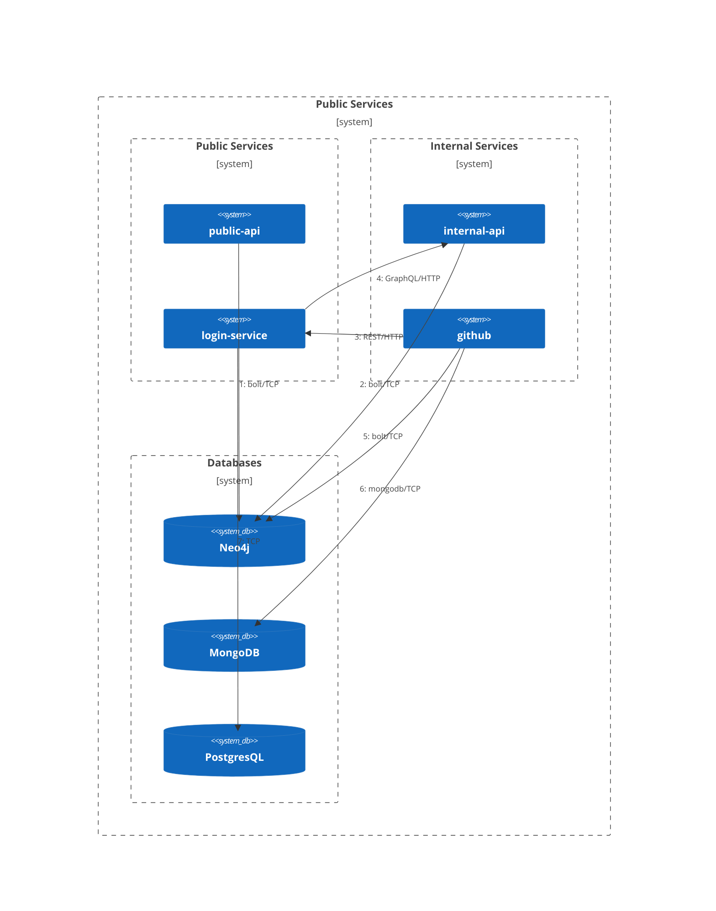

# Modules

# Runnable Modules

<div className="mermaid-c4">


    
</div>

## api-public

The main GraphQL API of the backend.
Can safely be publicly exposed and can be horizontally scaled. 
By default, users have to be authenticated. A JWT must be obtained via the authentication service (tbd) and then provided with each GraphQL request using the Authorization-Header:
```
Authorization: Bearer token
```
Authorization can be disabled for debugging purposes by setting `gropius.api.debugNoAuthentication=true`, however, note that mutations still require the token to determine the user (however permissions will not be checked).  
Depends on [api-common](#api-common)

#### Configuration
|Spring property|Default value|Description|
|--|--|--|
|gropius.api.public.debugNoAuthentication|`false`|If `true`, authorization is disabled|
|gropius.api.public.jwtSecret|- (required)|Secret for JWT validation. Caution: value is interpreted as Base64 encoded string!|

Configuration for [Spring Data Neo4j](https://docs.spring.io/spring-data/neo4j/docs/current/reference/html/#configure-spring-boot-project) is required.

#### Requirements
- Java >= 17

#### Runtime Dependencies
- Neo4j database

#### Run
```sh
./gradlew api-public:bootRun
```

## api-internal

The internal GraphQL API of the backend.
MUST NOT be publicly exposed as no authentication or authorization is done.
Can be horizontally scaled.
If the `gropius.api.internal.apiToken` config property is set, users have to be authenticated using the Authorization-Header:
```
Authorization: Bearer token
```
Depends on [api-common](#api-common)

#### Configuration
|Name|Default value|Description|
|--|--|--|
|gropius.api.internal.apiToken||If provided, each GraphQL request must provide the token in the Authorization header|

Configuration for [Spring Data Neo4j](https://docs.spring.io/spring-data/neo4j/docs/current/reference/html/#configure-spring-boot-project) is required.

#### Requirements
- Java >= 17

#### Runtime Dependencies
- Neo4j database

#### Run
```sh
./gradlew api-internal:bootRun
```

## login-service

Nodejs/Nestjs service that does the user management and authentication for the gropius-backend.
It will generate tokens for the user to use to identify against the api.

#### Configuration

<details>
<summary>General settings</summary>

|Environment variable|Default value|Description|
|--|--|--|
|GROPIUS_LOGIN_SPECIFIC_JWT_SECRET|- (required)|JWT secret used to sign tokens that are not access tokens to the backend. It is recommended to choos a different secret from GROPIUS_INTERNAL_BACKEND_JWT_SECRET to avoid token misuse. Make sure this is a LONG and RANDOM value and NOBONDY knows it. Else they can create valid tokens.|
|GROPIUS_JWT_ISSUER|gropius-login|The value to put in the issuer field all jwt signed.Can be any value but a unique value is recommended.|
|GROPIUS_ACCESS_TOKEN_EXPIRATION_TIME_MS|600000 (= 10min)|The time after which a issued access token for the backend expires and needs to be refreshed.Specify the value in ms.CAUTION: Access tokens can not easily be revoked. Don't make this time too long.|
|GROPIUS_OAUTH_CODE_EXPIRATION_TIME_MS|600000 (= 10min)|The time after which an oauth code, issued after finishing the oauth server flow, expires.This is the time a client has between receiving tha callback and fetching the access token.|
|GROPIUS_REGISTRATION_EXPIRATION_TIME_MS|600000 (= 10min)|The time after a registration of a new authentication until it expires. This is a time the USER between passing the authentication flow and submitting the registration form in the client.Don't set this too short or users will be frustrated, that they can't complete the registration.|
|GROPIUS_REGULAR_LOGINS_INACTIVE_EXPIRATION_TIME_MS|0|The time after which a regular login event (non sync login) will expire and refresh tokens become invalid. The actual time after which the user looses access is quantized by the expiration time of the issued access token. If 0, logins won't expire.|
|GROPIUS_PERFORM_IMS_USER_SEARCH_ON|=LOGIN,REG,REG_SYNC|The authentication events on which a search for yet unlinked ims users will be done. To link them to the authentication and (if present) the gropius user. Comma separated list.|
|GROPIUS_CLIENT_SECRET_LENGTH|48|The length (in bytes) of the generated client secrets for the oauth clients.|
|GROPIUS_LOGIN_LISTEN_PORT|3000|The port number on which to listen for API requests|

</details>

<details>
<summary>Gropius-backend internal API config</summary>

|Environment variable|Default value|Description|
|--|--|--|
|GROPIUS_INTERNAL_BACKEND_ENDPOINT|http://localhost:8081/graphql|The full GraphQL-API endpoint URL of the internal backend api (usually ends with /graphql). Remember: If running in docker-compose, you can use the docker service name as hostname.|
|GROPIUS_INTERNAL_BACKEND_TOKEN||The API secret that the internal backend API expects to allow requests. Will be prefixed with "Bearer ".|
|GROPIUS_INTERNAL_BACKEND_JWT_SECRET|- (required)|Secret to be used to sign the access tokens that can be used with the backend. Must be the same value as configured in the backend so the tokens are accepted. It is recommended to choos a different secret from GROPIUS_LOGIN_SPECIFIC_JWT_SECRET to avoid token misuse. Make sure this is a LONG and RANDOM value and NOBONDY knows it. Else they can create valid tokens. Caution: value is interpreted as Base64 encoded string!|

</details>

<details>
<summary>Database (postgres) configuration</summary>

|Environment variable|Default value|Description|
|--|--|--|
|GROPIUS_LOGIN_DATABASE_DRIVER|postgres|The database driver to use. Supported values: "postgres" (reccomended) and ("sqlite"). Note: The application relies on postgres specific types and SQL features in some places. The sqlite functionality is UNTESTED. To run the service without a running database (e.g. for api inspection) it is however useful to be able to switch to "sqlite".|
|GROPIUS_LOGIN_DATABASE_HOST|localhost|The hostname of the postgres databas server (remember: docker service names)|
|GROPIUS_LOGIN_DATABASE_PORT|5432|The port on which the postgres database is listening|
|GROPIUS_LOGIN_DATABASE_USER|postgres|The username in the postgres database to use|
|GROPIUS_LOGIN_DATABASE_PASSWORD|postgres|The password for the user specified above|
|GROPIUS_LOGIN_DATABASE_DATABASE|gropius|For postgres: Name of the database to use on the server. For sqlite: appended with ".sqlite" this specifies the Database file path|

</details>

<details>
<summary>Passport strategies options</summary>

|Environment variable|Default value|Description|
|--|--|--|
|GROPIUS_PASSPORT_STATE_JWT_ISSUER|gropius-login-state|The issuer to use in JWTs used to preserve state while using a oauth authentication provider. Using a different value than with GROPIUS_JWT_ISSUER is recommended to avoid token misuse.|
|GROPIUS_BCRYPT_HASH_ROUNDS|10|The number of rounds to pass to bcrypt when in use (e.g. for auth client secrets, passwords, ...). The actual number of rounds will be 2^GROPIUS_BCRYPT_HASH_ROUNDS.Choosing this wisely is importand. Too low makes the hashes unsecure and too high makes hasing take too long.|

</details>

<details>
<summary>Sync-service API settings</summary>

|Environment variable|Default value|Description|
|--|--|--|
|GROPIUS_LOGIN_SYNC_API_SECRET||The secret that is expected from a sync service client connecting to the sync API prefixed with "Bearer ". Set this to a long and unguessable value to ensure only the sync services can access tha api and request tokens from users.|

</details>

<details>
<summary>Entity management</summary>

The following section allows creating default strategy instance and user for initialization.
If none of the values are set (i.e. if they're commented out), no entity creation will take place.

Parameters for creating a strategy instance.
Type and instance cnfig must be given for creation to happen.
The config should follow the same rules as when creating through the API.

|Environment variable|Default value|Description|
|--|--|--|
|GROPIUS_DEFAULT_STRATEGY_INSTANCE_TYPE|userpass|Type of the default strategy instance|
|GROPIUS_DEFAULT_STRATEGY_INSTANCE_CONFIG|{}|Config of the default strategy instance|
|GROPIUS_DEFAULT_STRATEGY_INSTANCE_NAME|userpass-local|Name of the default strategy instance|

Parameters for creating an admin user.
Username, displayName and strategy instance name are required for creation to happen.
This can only create users for strategies that accept credentials via POST.
(i.e. not for oauth, ...). The structure/valiables of the post data must be the same as for the API request.
If a user with that username already exists or the credentials aren't unique, the creation will fail.

|Environment variable|Default value|Description|
|--|--|--|
|GROPIUS_DEFAULT_USER_USERNAME|administrator|Name of the default user|
|GROPIUS_DEFAULT_USER_DISPLAYNAME|System-Admin|Display name of the default user|
|GROPIUS_DEFAULT_USER_POST_DATA|{"password": "admin"}|Credentials for the default user that would otherwise have been passed via POST|
|GROPIUS_DEFAULT_USER_STRATEGY_INSTANCE_NAME|userpass-local|Name of the authentication strategy instance used for credential management|

|Environment variable|Default value|Description|
|--|--|--|
|GROPIUS_DEFAULT_AUTH_CLIENT_NAME|initial-client|Parameter for creating an auth client. If this is set, an auth client with that name and with no requirement for secrets will be created. The clientId of the created/found auth client will be printed to the console on startup.|

</details>

#### Requirements
- Node >= 16.17.0

#### Runtime Dependencies
- Postgres database
- [internal-api](#internal-api)

#### Run
```sh
# install
./gradlew login-service:npm_install
# run
./gradlew login-service:npm_start
```

## github

Github sync that executes exactly one sync cycle.
May not be executed more than once at the same time.
Documentation about the concept can be found [here](github.mdx).  
Depends on [sync](#sync)

#### Configuration
|Spring property|Default value|Description|
|--|--|--|
|gropius.sync.github.maxMutationCount|100|Maximum number of Mutations per cycle that are allowed for one IMS|

Configuration for [sync](#sync), [Spring Data Neo4j](https://docs.spring.io/spring-data/neo4j/docs/current/reference/html/#configure-spring-boot-project) and Spring Data MonoDB is required.

#### Requirements
- Java >= 17

#### Runtime Dependencies
- Neo4j database
- MongoDB database
- [login-service](#login-service)

#### Run
```sh
./gradlew github:bootRun
```

# Abstract Modules

## core

The core part of the Gropius backend, contains the domain model as well as service and repository classes.  
Requires a Neo4j database, for the configuration see [Configure the project](https://docs.spring.io/spring-data/neo4j/docs/current/reference/html/#configure-spring-boot-project).

#### Configuration

Configuration for [Spring Data Neo4j](https://docs.spring.io/spring-data/neo4j/docs/current/reference/html/#configure-spring-boot-project) is required.

#### Requirements
- Java >= 17

#### Runtime Dependencies
- Neo4j database

## api-common

Contains common functionality for [api-public](#api-public) and [api-internal](#api-internal).  
By default, the API is provided on port 8080 at the endpoint `/graphql`, a GraphiQL can be found at `/graphiql`. 
For the configuration of the GraphQL endpoints, see [Configuration Properties](https://opensource.expediagroup.com/graphql-kotlin/docs/server/spring-server/spring-properties).  
Depends on [core](#core)

#### Configuration

Configuration for [Spring Data Neo4j](https://docs.spring.io/spring-data/neo4j/docs/current/reference/html/#configure-spring-boot-project) is required.

#### Requirements
- Java >= 17

#### Runtime Dependencies
- Neo4j database

## sync

Contains abstract helpers for general sync development.  
Depends on [core](#core)

#### Configuration
|Spring property|Default value|Description|
|--|--|--|
|gropius.sync.loginServiceBase|- (required)|Base url of the login service|
|gropius.sync.apiSecret|- (required)|Secret for login service|

Configuration for [Spring Data Neo4j](https://docs.spring.io/spring-data/neo4j/docs/current/reference/html/#configure-spring-boot-project) is required.

#### Requirements
- Java >= 17

#### Runtime Dependencies
- Neo4j database
- [login-service](#login-service)
